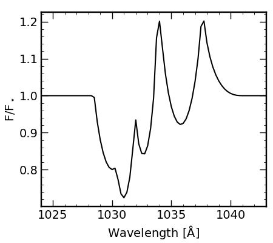

# OutLines
Computes spectral line profiles arising from galactic outflows following 
formalism and examples in Flury, Moran, & Eleazer (2023) MNRAS while 
remaining agnostic to the underlying physics.
Script currently supports nebular emission lines which do not undergo 
self-absorption (and are therefore always optically thin, i.e. "pure" 
emission) and absorption lines without infilling effects (although line 
infilling can be done manually to produce
P-Cygni line profiles).

Physically justifiable assumptions include the density profile
$$n \propto r^{-\alpha}$$
and velocity profile (from approximations to CAK theory)
$$v \propto (1-r^{-1})^{\beta}$$
under the Sobolev approximation that small-scale ("local")
gas velcities contribute negligibly to the net velocity field.

While this code is provided publicly, I request that any use thereof be 
cited in any publications in which this code is used. I developed and 
implemented this script for Flury, Moran, & Eleazer (2023) MNRAS with
example applications to the \[O III\] line in Mrk 462.

## Example Usage -- \[O III\] Profile for Mrk 462
``` python
from numpy import arange
from OutLines import *
# speed of light in km/s
c    = 2.99792458e5
# normalized [O III] 5007 flux
f5007 = 1.
# rest-frame wavelengths
wr = arange(4900,5050,0.25)
# predict line profiles for both [O III] doublet transitions using Mrk 462 results
oiii_outflow = 0.332*f5007 * phi_out(wr,5007-47.932,745/c,1,1.3) + \
                     f5007 * phi_out(wr,5007,745/c,1.122,1.369)
```
![image of predicted \[O III\] doublet profile](oiii_examp.png "[OIII]4959,5007 profile")

## Example Usage -- O VI P-Cygni Profile
``` python
from numpy import arange
from OutLines import *
# speed of light in km/s
c    = 2.99792458e5
# base 10 log of the classical cross-section
log_sig = -14.8247 # cm^2 km s^-1 Ang^-1
# user-defined values
vinf  = 1000. # km s^-1
alpha = 1
beta  = 1
N     = 21.5 # cm^-2
# atomic data for O VI from Morton 2003
rf = {'w':[1033.816,1037.6167,1031.9261],\
      'f':[1.983E-01,6.580E-02,1.325E-01],\
      'A':[4.125,4.076,4.149]}
# rest-frame wavelengths
wr = arange(1020,1050,0.25)
# predict line profiles for all three O VI transitions
absn = ones(len(wr))
emsn = zeros(len(wr))
for wave0,fosc,A in zip(rf['w'],rf['f'],rf['A']):
    absn *= exp( -10**(N+log_sig)*(wave0*fosc)/(vinf*c) * \
                    tau_out(wr,wave0,vinf/c,alpha,beta) )
    emsn += phi_out(wr,wave0,vinf/c,alpha,beta)*A/10
profile = absn + emsn
```


## BibTex
``` bibtex
@ARTICLE{2023arXiv230804393F,
       author = {{Flury}, Sophia R. and {Moran}, Edward C. and {Eleazer}, Miriam},
        title = "{Galactic Outflow Emission Line Profiles: Evidence for Dusty, Radiatively-Driven Ionized Winds in Mrk 462}",
      journal = {arXiv e-prints},
     keywords = {Astrophysics - Astrophysics of Galaxies},
         year = 2023,
        month = aug,
          eid = {arXiv:2308.04393},
        pages = {arXiv:2308.04393},
archivePrefix = {arXiv},
       eprint = {2308.04393},
 primaryClass = {astro-ph.GA},
       adsurl = {https://ui.adsabs.harvard.edu/abs/2023arXiv230804393F},
      adsnote = {Provided by the SAO/NASA Astrophysics Data System}
}
```

## Licensing
This program is free software: you can redistribute it and/or modify it under the terms of the GNU General Public License as published by the Free Software Foundation, either version 3 of the License, or (at your option) any later version.

This program is distributed in the hope that it will be useful, but WITHOUT ANY WARRANTY; without even the implied warranty of MERCHANTABILITY or FITNESS FOR A PARTICULAR PURPOSE. See the GNU General Public License for more details.

You should have received a copy of the GNU General Public License along with this program. If not, see <https://www.gnu.org/licenses/>.
