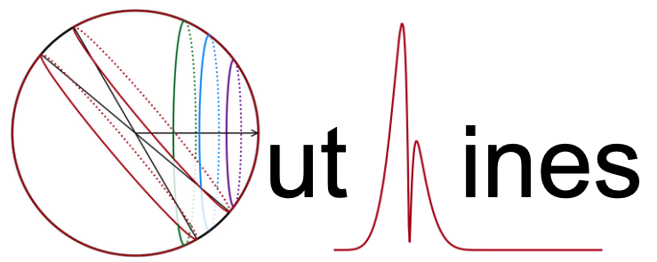

# NEW VERSION AND FULL RELEASE COMING SOON!!
## Expected June/July 2025

Computes spectral line profiles arising from galactic outflows following 
formalism and examples in [Flury, Moran, & Eleazer (2023) MNRAS](https://ui.adsabs.harvard.edu/abs/2023MNRAS.525.4231F) while 
remaining agnostic to the underlying physics. A cartoon of the model 
illustrating the observation of spherical outflows is shown below,
depecting the Doppler shift (colored arrows) of light emitted (yellow and 
orange) and absorbed (orange) by gas in the outflow.


Script currently supports nebular emission lines which do not undergo 
self-absorption (and are therefore always optically thin, i.e. "pure" 
emission) and absorption lines without infilling effects (although line 
infilling can be done manually to produce P-Cygni line profiles, as 
demonstrated below).

Physically justifiable assumptions include the density profile
$$n \propto r^{-\alpha}$$
and velocity profile (from approximations to CAK theory)
$$v \propto (1-r^{-1})^{\beta}$$
under the Sobolev approximation that small-scale ("local")
gas velcities contribute negligibly to the net velocity field.

Emission and absorption profiles are computed in velocity space for the
specified wavelength(s). Each profile must be computed separately. Following
the equation of radiative transfer, emission line profiles should be added 
in flux space while absorption line profiles should be added in 
optical depth space. The returned profiles for each type of line are
intended to facilitate adding in these respective spaces.

## Example Usage -- \[O III\] 4959,5007 Profile for Mrk 462
``` python
from numpy import arange
from OutLines import *
# speed of light in km/s
c    = 2.99792458e5
# normalized [O III] 5007 flux
f5007 = 1.
# rest-frame wavelengths
wr = arange(4900,5050,0.25)
# predict line profiles for both [O III] doublet transitions using Mrk 462 results
oiii_outflow = 0.332*f5007 * phi_out(wr,5007-47.932,745/c,1,1.3) + \
                     f5007 * phi_out(wr,5007,745/c,1.122,1.369)
```


## Example Usage -- Si II 1260 Profile
``` python
from numpy import arange
from OutLines import *
from scipy.special import wofz
# speed of light in km/s
c    = 2.99792458e5
# base 10 log of the classical cross-section
log_sig = -14.8247 # cm^2 km s^-1 Ang^-1
# atomic data from Morton 2003
wave0 = 1260.4221
fosc  = 1.18
# user-defined values
vinf  = 1000. # km s^-1 -> outflow velocity
sigv  = 100.  # km s^-1 -> static gas velocity (galaxy rotation)
alpha = 1
beta  = 1
N     = 15.0  # cm^-2
f     = 0.10 # fraction of Si II column in static component
# rest-frame wavelengths
wr = arange(1250,1270,0.25)
# optical depth for outflow
absn_out = (wave0*fosc) * tau_out(wr,wave0,vinf/c,alpha,beta)/vinf
# static Voigt profile optical depth
absn_stc = wofz((wr-wave0)/(wave0 * sigv/c)).real*(wave0*fosc)/sigv
# additively combine optical depths in exponent
profile = exp(-10**(N+log_sig)*((1-f)*absn_out+f*absn_stc))
```


## Example Usage -- O VI P-Cygni Profile
``` python
from numpy import arange
from OutLines import *
# speed of light in km/s
c    = 2.99792458e5
# base 10 log of the classical cross-section
log_sig = -14.8247 # cm^2 km s^-1 Ang^-1
# user-defined values
vinf  = 1000. # km s^-1
alpha = 1
beta  = 1
N     = 16.0  # cm^-2
# atomic data for O VI from Morton 2003
rf = {'w':[1033.816,1037.6167,1031.9261],\
      'f':[1.983E-01,6.580E-02,1.325E-01],\
      'A':[4.125,4.076,4.149]}
# rest-frame wavelengths
wr = arange(1020,1050,0.25)
# predict line profiles for all three O VI transitions
absn = zeros(len(wr))
emsn = zeros(len(wr))
for wave0,fosc,A in zip(rf['w'],rf['f'],rf['A']):
    absn += (wave0*fosc) * tau_out(wr,wave0,vinf/c,alpha,beta)/vinf
    emsn += phi_out(wr,wave0,vinf/c,alpha,beta)*A/10
profile = exp(-10**(N+log_sig)*absn) + emsn
```


## Referencing `OutLines`

While this code is provided publicly, it did require quite a bit of effort to develop 
and document. I request that any use thereof be cited in any publications in which 
this code is used. I developed and implemented this script for 
[Flury, Moran, & Eleazer (2023) MNRAS 525, 4231](https://ui.adsabs.harvard.edu/abs/2023MNRAS.525.4231F) 
with example applications to the 
\[O III\] line in Mrk 462. The BibTeX reference is below; however, a GitHub CCF
is also provided for convenience.

``` bibtex
@ARTICLE{2023MNRAS.525.4231F,
       author = {{Flury}, Sophia R. and {Moran}, Edward C. and {Eleazer}, Miriam},
        title = "{Galactic outflow emission line profiles: evidence for dusty, radiatively driven ionized winds in Mrk 462}",
      journal = {\mnras},
         year = 2023,
        month = nov,
       volume = {525},
       number = {3},
        pages = {4231-4242},
          doi = {10.1093/mnras/stad2421} }
```

The Zenodo DOI is also available here:
[](https://zenodo.org/doi/10.5281/zenodo.11238265)


## Licensing
This program is free software: you can redistribute it and/or modify it under the terms of the GNU General Public License as published by the Free Software Foundation, either version 3 of the License, or (at your option) any later version. This program is distributed in the hope that it will be useful, but WITHOUT ANY WARRANTY; without even the implied warranty of MERCHANTABILITY or FITNESS FOR A PARTICULAR PURPOSE. See the GNU General Public License for more details.

You should have received a copy of the GNU General Public License along with this program. If not, see <https://www.gnu.org/licenses/>.
