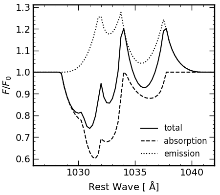

# OutLines
Computes spectral line profiles arising from galactic outflows following 
formalism and examples in Flury, Moran, & Eleazer (2023) MNRAS while 
remaining agnostic to the underlying physics.
Script currently supports nebular emission lines which do not undergo 
self-absorption (and are therefore always optically thin, i.e. "pure" 
emission) and absorption lines without infilling effects (although line 
infilling can be done manually, as in the example below, to produce
P-Cygni line profiles).

Physically justifiable assumptions include the density profile
$$n \propto r^{-\alpha}$$
and velocity profile (from approximations to CAK theory)
$$v \propto (1-r^{-1})^{\beta}$$
under the Sobolev approximation that small-scale ("local")
gas velcities contribute negligibly to the net velocity field.

While this code is provided publicly, I request that any use thereof be 
cited in any publications in which this code is used. I developed and 
implemented this script for Flury, Moran, & Eleazer (2023) MNRAS with
example applications to the \[O III\] line in Mrk 462.

## Example Usage -- \[O III\] Profile for Mrk 462
```
from numpy import arange
from OutLines import *
# speed of light in km/s
c    = 2.99792458e5
# rest-frame wavelengths
wr = arange(4900,5050,0.25)
# predict line profiles for both [O III] doublet transitions using Mrk 462 results
oiii_outflow = 0.332*f5007 * phi_out(wr,5007-47.932,745/c,1,1.3) + f5007 * phi_out(wr,5007,745/c,1.122,1.369)
```
![image of predicted \[O III\] doublet profile](oiii_examp.png "[OIII]4959,5007 profile")

## Example Usage -- O VI P-Cygni Profile
```
from numpy import arange,prod
from OutLines import *
'''
Name:
    pcyg

Purpose:
    Approximate a P-Cygni profile assuming no self-absorption and no local
    velocity fluctuations relative to the velocity field, i.e., pure absorption
    plus pure emission.

Arguments:
    :wave  (*np.ndarray*) : array of observed wavelengths
    :wave0 (*float*) : rest-frame central wavelength
    :fosc  (*float*) : absorption line oscillator strength
    :A     (*float*) : spontaneous radiative emission coefficient in s^-1
    :N     (*float*) : column density in cm^-2
    :vinf  (*float*) : terminal velocity in c units
    :alpha (*float*) : power-law index of density field
    :beta  (*float*) : power-law index of velocity field
    :Cf    (*float*) : absorption line covering fraction

Keyword Arguments:
    :log_sig (*float*) : base 10 log of the classical cross-section
                         sigma = 10^-14.8247 cm^2 km s^-1 Ang^-1

Returns:
    :phiTot (*np.ndarray*): P-Cygni-like line profile
'''
def pcyg(wave,wave0,fosc,A,N,vinf,Cf,alpha,beta,log_sig=-14.8247):
    tau = 1./(vinf*c)*tau_out(wave,wave0,vinf,alpha,beta)
    phi = phi_out(wave,wave0,vinf,alpha,beta)
    return Cf*(exp(-10**(N+log_sig) * wave0 * fosc * tau)-1)+1+phi*A/10
# speed of light in km/s
c    = 2.99792458e5
# user-defined values
vtrm = 1000. # km s^-1
alph = 1
beta = 1
Cf   = 1
# atomic data for O VI from Morton 2003
rf = {'w':[1033.816,1037.6167,1031.9261],\
      'f':[1.983E-01,6.580E-02,1.325E-01],\
      'A':[4.125,4.076,4.149]}
# rest-frame wavelengths
wr = arange(1020,1050,0.25)
# predict line profiles for all three O VI transitions
absn = prod(list(map(lambda w0,f,A: \
          pcyg(wr,w0,f,A,16,vtrm/c,Cf,alph,beta),\
          rf['w'],rf['f'],rf['A'])),axis=0)
```



## BibTex
*pending*

## Licensing
This program is free software: you can redistribute it and/or modify it under the terms of the GNU General Public License as published by the Free Software Foundation, either version 3 of the License, or (at your option) any later version.

This program is distributed in the hope that it will be useful, but WITHOUT ANY WARRANTY; without even the implied warranty of MERCHANTABILITY or FITNESS FOR A PARTICULAR PURPOSE. See the GNU General Public License for more details.

You should have received a copy of the GNU General Public License along with this program. If not, see <https://www.gnu.org/licenses/>.
